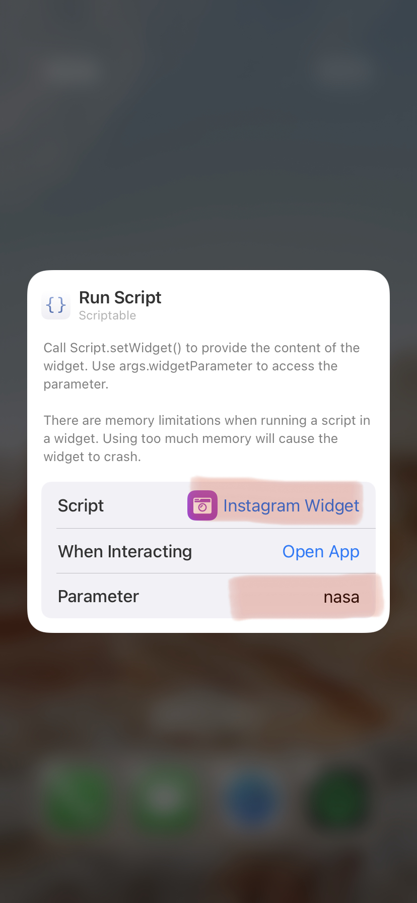

# Instagram Widget

With the Instagram Widget you can customise your homescreen to show your profile status, your favourite pictures or the growth of a profile. You will find a few [examples](#examples) below.

## Instructions

To get this widget to work copy the contents of [Instagram Widget]("./Instagram Widget.js"), create a new widget in Scriptable and paste the copied code. Then add a Scriptable widget to your home screen (all sizes are supported, check the [examples](#examples) to find wich size suits your needs).


<!---->

After adding the widget to your homescreen you will have to set the script and the widget parameter. The script has to be the one you caopied all the code into and the parameter needs to be a valid instagram username.

**Additional notes**

* You will need to run the script inside Scriptable first
* You will need to login to instagram when running the script the first time (this is [https://instagram.com/](https://instagram.com/))
* The widget parameter can be any username, but only a private user if you follow then with the account you're logging in with
* Have fun :)

## Examples
### Small Widget
```
parameter = username
```


<!---->

The small widget is for viewing current followers and media count.

### Medium Widget
```
parameter = username
```


<!---->

The medium widget shows random recent pictures.

### Large Widget
```
parameter = username
```


<!---->

As the widgets are updated, the fetched profile data is logged into files (iCloud/Scriptable/IGWidget/Logs). This widget shows the growth/change of your/the users follower count over time (last 24h).

## For anyone who wants to know
### Caching

The Instagram Widget is caching your instagram session id cookie, to fetch the profile data. Also any time the data is fetched, it is cached (this is per profile). For example, if you create a small widget with username xy and a medium widget with username yz, there will be one cache file per user. The cache files are updated every hour, to not send to many queries to instagram (if this happens, instagram will temp-block your user).

### Logging

Every time the user data is renewed three main data points are logged (this also happens per user):

* follower count
* following count
* media count

The data is logged for use in the large widget.
